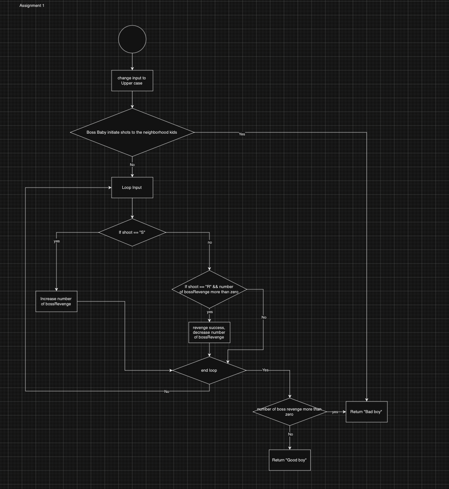

# Boss-Baby-s-Revenge

## Description
The `BossBabyRevenge` function determines whether Boss Baby is a "Good boy" or a "Bad boy" based on the shots taken by Boss Baby (`S`) and the shots taken by the neighborhood kids (`R`).


## Function Signature
```go
func BossBabyRevenge(shot string) string
```

## Parameters

shot: A string representing the sequence of shots taken, where S represents shots taken by Boss Baby and R represents shots taken by kids.
Returns A string indicating whether Boss Baby is a "Good boy" or a "Bad boy".

## Usage
```go
package main

import (
	"fmt"
)

func main() {
	// Example usage
	result := BossBabyRevenge("SRSSRRR")
	fmt.Println(result) // Output: Good boy
}
```

## How It Works

The `BossBabyRevenge` function determines whether Boss Baby is a "Good boy" or a "Bad boy" based on the shots taken. Here's how it operates:

1. **Check Initiation**: The function first checks if Boss Baby initiated shots to the neighborhood kids. If Boss Baby initiated the fight (if `R` is the first shot), the function immediately returns "Bad boy".

2. **Count Shots**: For each shot in the sequence:
   - If it's a shot taken by Boss Baby (`S`), the `bossRevenge` count increases.
   - If it's a shot taken by kids (`R`) and Boss Baby has already taken shots (`bossRevenge > 0`), the `bossRevenge` count decreases.

3. **Determine Result**: After processing all shots, the function evaluates the `bossRevenge` count. If the count is greater than 0, Boss Baby is considered a "Bad boy". Otherwise, Boss Baby is considered a "Good boy".

