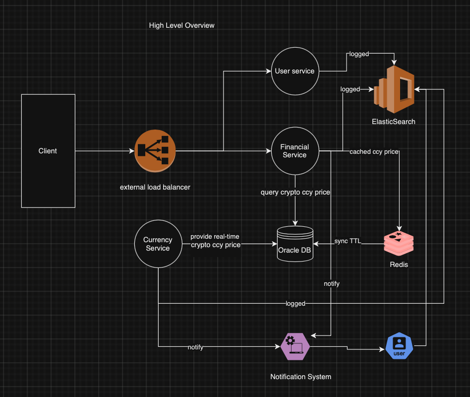

### Design Oracle System



1. **System Interface with Various Sources for Crypto Currency Prices:**
   - When a client requests cryptocurrency prices through the financial service, it queries cryptocurrency prices by specific currency (e.g., USDT, BTC, etc.).
   - The fetched prices are cached in Redis with a TTL.

2. **Steps to Retrieve Real-Time Data and Data Format for Clients:**
   - **REST API Endpoint:** `GET: /api/v1/get_rate`
   ```json
   {
       "code": 200,
       "status": "Ok",
       "valid_from": 600000,
       "valid_to": 600000,
       "data": [
           {
               "currency_code": "USDT",
               "bid": 35.46,
               "ask": 35.78
           },
           {
               "currency_code": "BTC",
               "bid": 35.46,
               "ask": 35.78
           }
       ]
   }

3. **Explain the oracle system will accommodate client's need for transmitting crypto currency prices:**
   - The currency service will transmit crypto currency to database following by 


| COLUMN_NAME   | DATA_TYPE    | NULLABLE | DATA_DEFAULT   | COLUMN_ID |
|---------------|--------------|----------|----------------|-----------|
| ID            | NUMBER       | NO       | RUNNING NUMBER | 1         |
| CURRENCY_CODE| VARCHAR2(5)  | NO       |                | 2         |
| BID           | NUMBER(18,2) | NO       |                | 3         |
| ASK           | NUMBER(18,2) | NO       |                | 4         |
| VALID_FROM    | NUMBER(18,2) | NO       |                | 5         |
| VALID_TO      | NUMBER(18,2) | NO       |                | 6         |


4. **Error Handling & Resilience:**
    - In case of Currency service has error occurred it will let user knows by send notification, 
In case of Oracle DB has internal server error, financial service still available because they has cached in redis,
by the way any event occurred will logged in elastic search